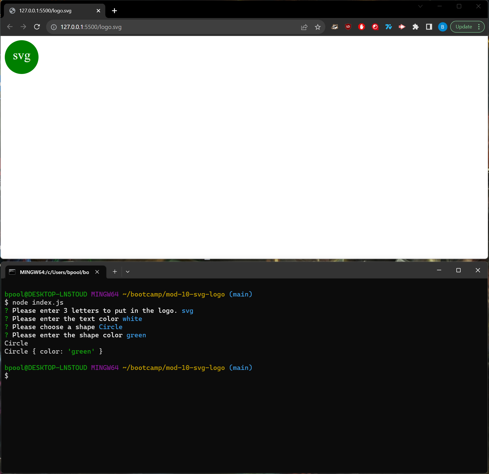

# SVG Logo Generator

## Video Walkthrough
[A Functionality Walkthrough](https://www.youtube.com/watch?v=yDEcpbt_dfY&ab_channel=BenPoole)

## Description
This is an application that is able to generate an svg file based on paraments input by the user.

## Installation
N/A
    
## Usage
The user is able to:  
Answer questions prompted to them by inquirer.  
Based on their answers an svg file will be created.  
They are then able to display the svg file in a browser.  
They are also able to test the Triange, Circle, and Square classes using jest  
    
## Contribution Guidelines
N/A
    
## License
N/A
    
## Email Address
If you have any questions or concerns please reach out to me at bpoole53@gmail.com